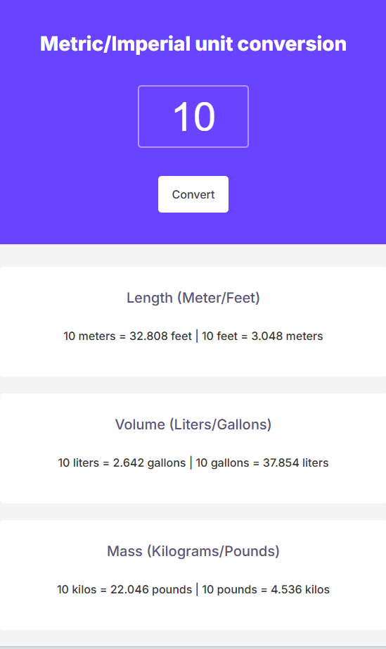
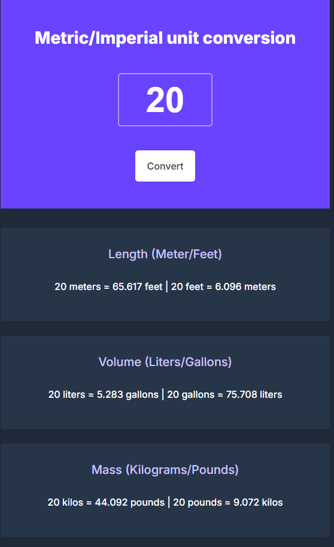

# Unit Converter

A clean and responsive web application that converts between metric and imperial units. This tool provides instant conversions for length, volume, and mass measurements.

## Features

- Convert between:
  - Meters ↔️ Feet
  - Liters ↔️ Gallons
  - Kilograms ↔️ Pounds
- Real-time conversion
- Clean and responsive design
- Support for keyboard input (Enter key)
- Mobile-friendly interface

## Technologies Used

- HTML5
- CSS3
- JavaScript (Vanilla)
- Google Fonts (Inter)

## Live Demo

## Light theme


## Dark theme


## Installation and Setup

1. Clone the repository:
```bash
git clone https://github.com/ahmed-bahlaoui/metric-imperial-unit-conversion
